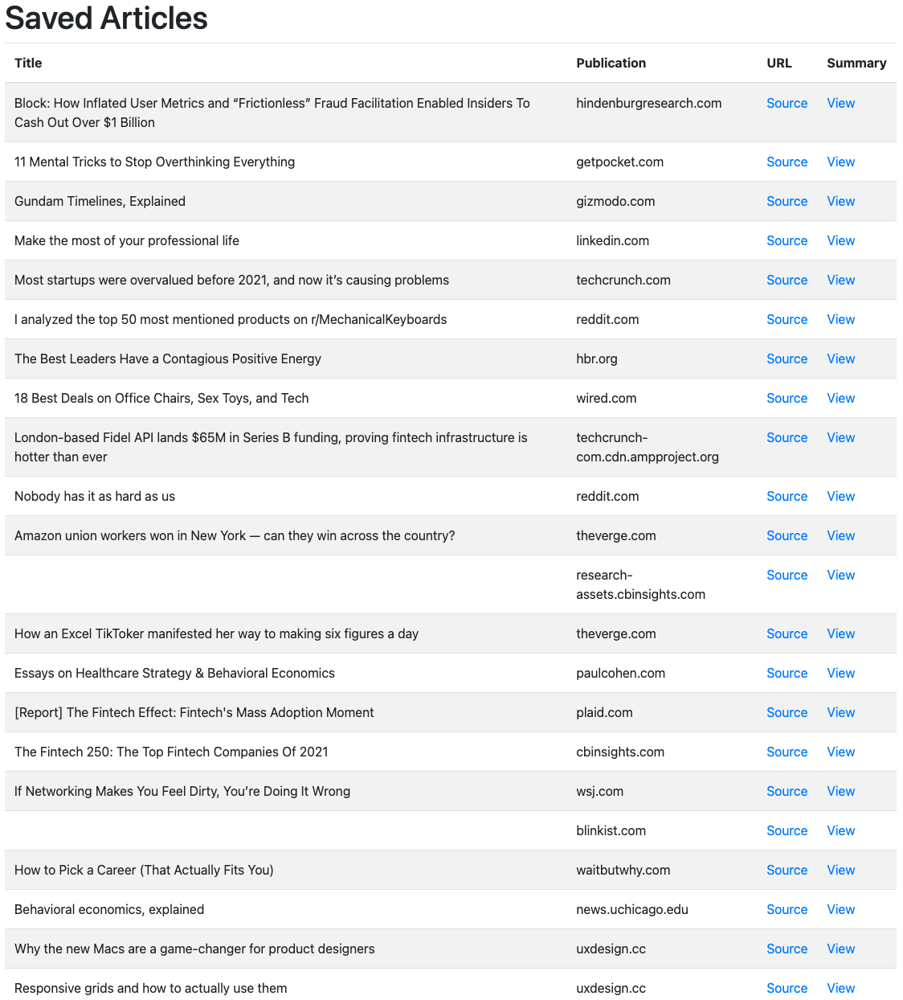
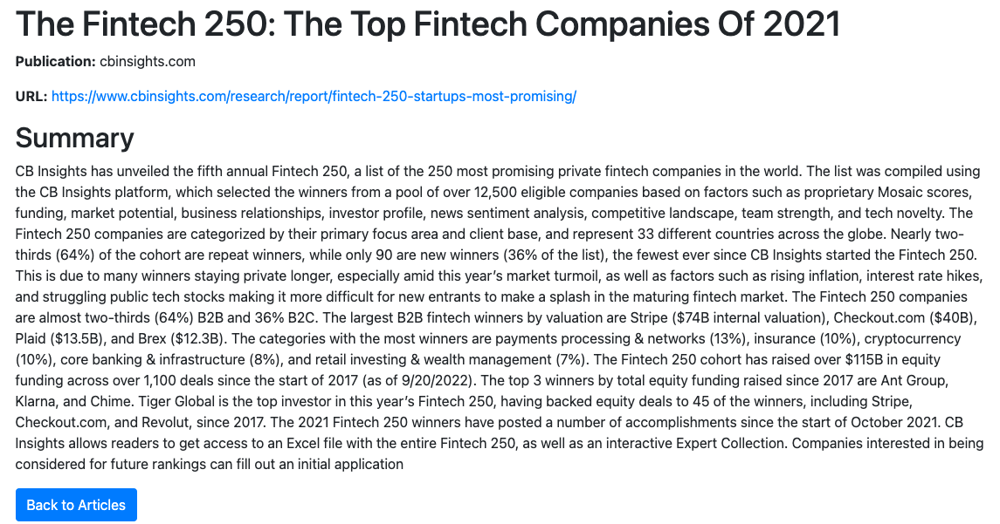

# Pocket Archive
I have a total of 144 unread articles saved to [Pocket](getpocket.com). More than I realistically am capable of catching up on.

I've made this web app (Flask) with the GetPocket API to allow me to list these articles, and click-through to a page that summarizes the article for me using OpenAI's API (text-davinci-003).

To mitigate API usage costs, OpenAI's API is only called when the user clicks on an article to summarize.

**Note:** There is an issue with the summarization of longer articles such that longer articles will return an error because the context limit is reached at 4097 tokens. I plan to add handling for this.

## Setup
1. Clone the repo.
2. *pip install -r requirements.txt* to install dependencies.
3. Fill in [.env.copy](.env.copy) with your Pocket API key and OpenAI API key and save it as ".env".
3. Run [tokens.py](tokens.py) (first this will get your request token, then follow through to the redirect it generates and authorize, then press enter to get your access token).
4. Run *app.py* to start the server.
5. Navigate to http://127.0.0.1:5000/ in your browser.

## List View

## Summary View
